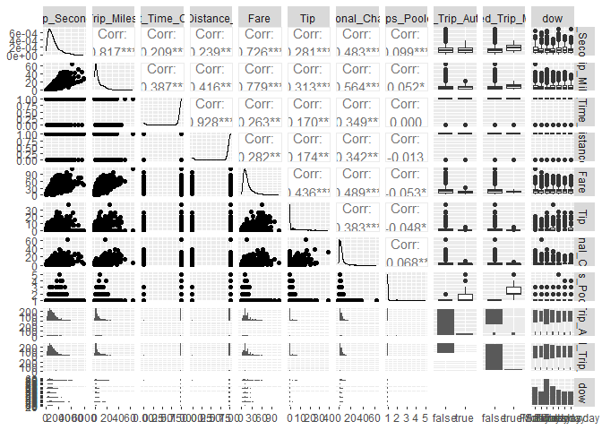
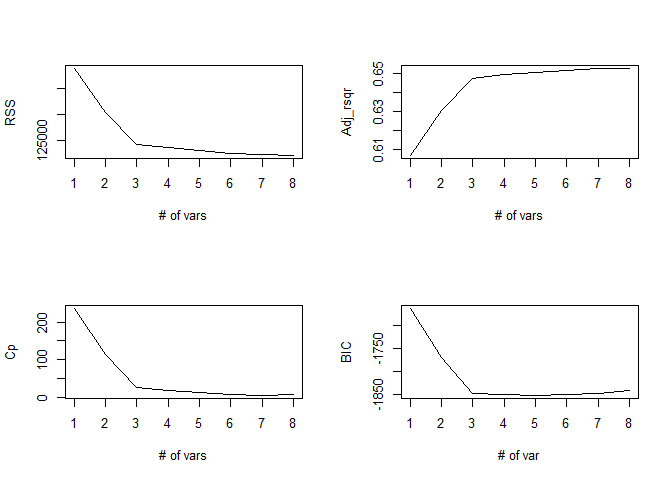
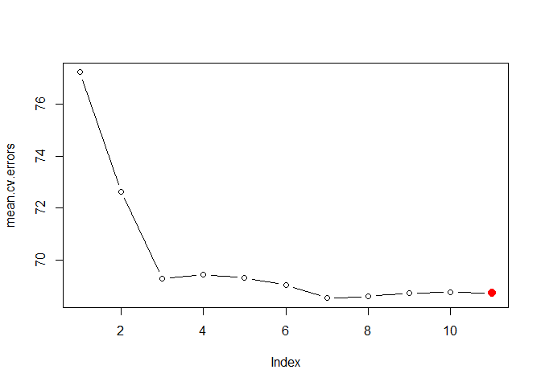
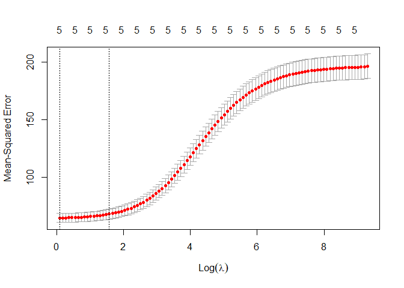
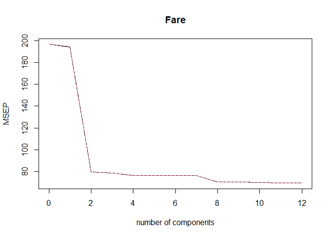
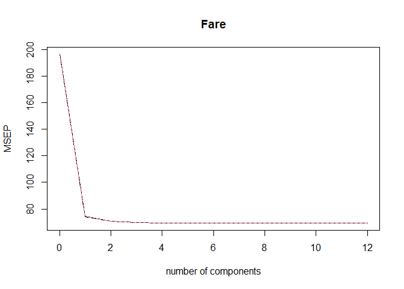
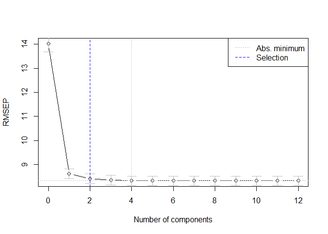

Untitled
================

## Setup

``` r
library(data.table)
library(sqldf)
```

    ## Loading required package: gsubfn

    ## Loading required package: proto

    ## Loading required package: RSQLite

``` r
library(ggplot2)
library(GGally)
```

    ## Registered S3 method overwritten by 'GGally':
    ##   method from   
    ##   +.gg   ggplot2

``` r
library(leaps)
library(MASS)
library(glmnet)
```

    ## Loading required package: Matrix

    ## Loaded glmnet 4.1-8

``` r
library(pls)
```

    ## 
    ## Attaching package: 'pls'

    ## The following object is masked from 'package:stats':
    ## 
    ##     loadings

``` r
library(boot)
library(gridExtra)
library(splines)
library(caret)
```

    ## Loading required package: lattice

    ## 
    ## Attaching package: 'lattice'

    ## The following object is masked from 'package:boot':
    ## 
    ##     melanoma

    ## 
    ## Attaching package: 'caret'

    ## The following object is masked from 'package:pls':
    ## 
    ##     R2

``` r
library(alr4)
```

    ## Loading required package: car

    ## Loading required package: carData

    ## 
    ## Attaching package: 'car'

    ## The following object is masked from 'package:boot':
    ## 
    ##     logit

    ## Loading required package: effects

    ## Use the command
    ##     lattice::trellis.par.set(effectsTheme())
    ##   to customize lattice options for effects plots.
    ## See ?effectsTheme for details.

## Read Data

This data csv is 2GB, way too big to read in on its own, so lets filter
it down a bit.

``` r
csv_pth = "C:\\Users\\jpaul4\\Downloads\\Transportation_Network_Providers_-_Trips__2023-__20240801.csv"

#Get coloumn names
top_10 = sqldf::read.csv.sql(csv_pth, sql= "select * from file limit 10")
```

## Select a sample from this CSV to use as our training data

I selected a random set of 2000 rows using the SQL command “SELECT \*
FROM chic_trips ORDER BY RANDOM() LIMIT 2000;” for training and testing.

``` r
csv_sample = "C:\\Users\\jpaul4\\Box\\Summer 2024\\S2405\\Projects\\Final Project\\result_set.csv"
trips = read.csv(csv_sample)
head(trips)
```

    ##    PK_UID                                  Trip_ID   Trip_Start_Timestamp
    ## 1 1078724 a45e404c67637a35ba8c68eb02abd0ef57a27851 06/26/2024 10:15:00 PM
    ## 2 5948098 9bd17c2ea621b7c1bba3725d89c18b45ac574971 06/07/2024 03:15:00 PM
    ## 3 1058729 92cc46f8531e33eee0e5a21cda3cb34d7997e0c8 06/27/2024 12:45:00 AM
    ## 4 2375826 4c4659ad8d22f0f0177e79e2140023a9ffea9ea2 06/21/2024 08:30:00 PM
    ## 5  559953 aceb9a135afb3a822bce97dbf5f80b31fa951c3d 06/28/2024 10:30:00 PM
    ## 6 7199958 8fd92610f23c8513b2618355ea3dbaf1ac734e37 06/02/2024 05:30:00 AM
    ##       Trip_End_Timestamp Trip_Seconds Trip_Miles Percent_Time_Chicago
    ## 1 06/26/2024 10:30:00 PM         1124        4.9                    1
    ## 2 06/07/2024 03:30:00 PM          896        3.0                    1
    ## 3 06/27/2024 01:30:00 AM         1994       27.8                    0
    ## 4 06/21/2024 09:15:00 PM         2963       26.9                    1
    ## 5 06/28/2024 10:45:00 PM          816        2.4                    1
    ## 6 06/02/2024 06:00:00 AM         2260       32.4                    1
    ##   Percent_Distance_Chicago Pickup_Census_Tract Dropoff_Census_Tract
    ## 1                        1                  NA                   NA
    ## 2                        1                  NA                   NA
    ## 3                        0         17031980000                   NA
    ## 4                        1                  NA                   NA
    ## 5                        1         17031081403          17031842200
    ## 6                        1         17031820901          17031980000
    ##   Pickup_Community_Area Dropoff_Community_Area Fare Tip Additional_Charges
    ## 1                    28                      6 32.5   0               1.23
    ## 2                    28                     24 17.5   0               5.68
    ## 3                    76                     NA 60.0  12              21.39
    ## 4                    NA                      6 22.5   0               6.95
    ## 5                     8                      8 10.0   0               1.23
    ## 6                    NA                     76 47.5  12              28.12
    ##   Trip_Total Shared_Trip_Authorized Shared_Trip_Match Trips_Pooled
    ## 1      33.73                  false             false            1
    ## 2      23.18                  false             false            1
    ## 3      93.39                  false             false            1
    ## 4      29.45                  false             false            1
    ## 5      11.23                  false             false            1
    ## 6      87.62                  false             false            1
    ##   Pickup_Centroid_Latitude Pickup_Centroid_Longitude
    ## 1                 41.87400                 -87.66352
    ## 2                 41.87400                 -87.66352
    ## 3                 41.97907                 -87.90304
    ## 4                       NA                        NA
    ## 5                 41.89092                 -87.61887
    ## 6                       NA                        NA
    ##               Pickup_Centroid_Location Dropoff_Centroid_Latitude
    ## 1  POINT (-87.6635175498 41.874005383)                  41.94423
    ## 2  POINT (-87.6635175498 41.874005383)                  41.90121
    ## 3 POINT (-87.9030396611 41.9790708201)                        NA
    ## 4                                                       41.94423
    ## 5 POINT (-87.6188683546 41.8909220259)                  41.90494
    ## 6                                                       41.97907
    ##   Dropoff_Centroid_Longitude            Dropoff_Centroid_Location
    ## 1                  -87.65600 POINT (-87.6559981815 41.9442266014)
    ## 2                  -87.67636 POINT (-87.6763559892 41.9012069941)
    ## 3                         NA                                     
    ## 4                  -87.65600 POINT (-87.6559981815 41.9442266014)
    ## 5                  -87.64991 POINT (-87.6499072264 41.9049353016)
    ## 6                  -87.90304 POINT (-87.9030396611 41.9790708201)

``` r
summary(trips)
```

    ##      PK_UID          Trip_ID          Trip_Start_Timestamp Trip_End_Timestamp
    ##  Min.   :   2180   Length:2000        Length:2000          Length:2000       
    ##  1st Qu.:1857128   Class :character   Class :character     Class :character  
    ##  Median :3728684   Mode  :character   Mode  :character     Mode  :character  
    ##  Mean   :3749083                                                             
    ##  3rd Qu.:5638863                                                             
    ##  Max.   :7588816                                                             
    ##                                                                              
    ##   Trip_Seconds      Trip_Miles     Percent_Time_Chicago
    ##  Min.   :  55.0   Min.   : 0.200   Min.   :0.0000      
    ##  1st Qu.: 615.8   1st Qu.: 2.175   1st Qu.:1.0000      
    ##  Median : 991.5   Median : 4.400   Median :1.0000      
    ##  Mean   :1218.3   Mean   : 7.336   Mean   :0.9325      
    ##  3rd Qu.:1583.0   3rd Qu.:10.000   3rd Qu.:1.0000      
    ##  Max.   :5937.0   Max.   :63.900   Max.   :1.0000      
    ##                                    NA's   :1           
    ##  Percent_Distance_Chicago Pickup_Census_Tract Dropoff_Census_Tract
    ##  Min.   :0.0000           Min.   :1.703e+10   Min.   :1.703e+10   
    ##  1st Qu.:1.0000           1st Qu.:1.703e+10   1st Qu.:1.703e+10   
    ##  Median :1.0000           Median :1.703e+10   Median :1.703e+10   
    ##  Mean   :0.9275           Mean   :1.703e+10   Mean   :1.703e+10   
    ##  3rd Qu.:1.0000           3rd Qu.:1.703e+10   3rd Qu.:1.703e+10   
    ##  Max.   :1.0000           Max.   :1.703e+10   Max.   :1.703e+10   
    ##  NA's   :1                NA's   :775         NA's   :775         
    ##  Pickup_Community_Area Dropoff_Community_Area      Fare             Tip        
    ##  Min.   : 1.00         Min.   : 1.00          Min.   :  0.00   Min.   : 0.000  
    ##  1st Qu.: 8.00         1st Qu.: 8.00          1st Qu.: 10.00   1st Qu.: 0.000  
    ##  Median :25.00         Median :28.00          Median : 15.00   Median : 0.000  
    ##  Mean   :28.14         Mean   :29.01          Mean   : 19.02   Mean   : 1.527  
    ##  3rd Qu.:37.00         3rd Qu.:38.00          3rd Qu.: 22.50   3rd Qu.: 2.000  
    ##  Max.   :77.00         Max.   :77.00          Max.   :110.00   Max.   :38.000  
    ##  NA's   :189           NA's   :185            NA's   :1        NA's   :1       
    ##  Additional_Charges   Trip_Total     Shared_Trip_Authorized Shared_Trip_Match 
    ##  Min.   : 0.000     Min.   :  0.00   Length:2000            Length:2000       
    ##  1st Qu.: 2.010     1st Qu.: 13.73   Class :character       Class :character  
    ##  Median : 3.700     Median : 19.43   Mode  :character       Mode  :character  
    ##  Mean   : 4.691     Mean   : 25.24                                            
    ##  3rd Qu.: 5.715     3rd Qu.: 29.69                                            
    ##  Max.   :62.680     Max.   :129.41                                            
    ##  NA's   :1          NA's   :1                                                 
    ##   Trips_Pooled   Pickup_Centroid_Latitude Pickup_Centroid_Longitude
    ##  Min.   :1.000   Min.   :41.66            Min.   :-87.91           
    ##  1st Qu.:1.000   1st Qu.:41.87            1st Qu.:-87.69           
    ##  Median :1.000   Median :41.89            Median :-87.65           
    ##  Mean   :1.042   Mean   :41.89            Mean   :-87.67           
    ##  3rd Qu.:1.000   3rd Qu.:41.94            3rd Qu.:-87.63           
    ##  Max.   :5.000   Max.   :42.02            Max.   :-87.53           
    ##                  NA's   :183              NA's   :183              
    ##  Pickup_Centroid_Location Dropoff_Centroid_Latitude Dropoff_Centroid_Longitude
    ##  Length:2000              Min.   :41.66             Min.   :-87.91            
    ##  Class :character         1st Qu.:41.87             1st Qu.:-87.70            
    ##  Mode  :character         Median :41.89             Median :-87.66            
    ##                           Mean   :41.89             Mean   :-87.67            
    ##                           3rd Qu.:41.94             3rd Qu.:-87.63            
    ##                           Max.   :42.02             Max.   :-87.55            
    ##                           NA's   :177               NA's   :177               
    ##  Dropoff_Centroid_Location
    ##  Length:2000              
    ##  Class :character         
    ##  Mode  :character         
    ##                           
    ##                           
    ##                           
    ## 

## Add some calc columns

``` r
trips$Trip_Start_Timestamp = as.Date(trips$Trip_Start_Timestamp, format="%m/%d/%Y")
trips$dow = weekdays(trips$Trip_Start_Timestamp)
head(trips)
```

    ##    PK_UID                                  Trip_ID Trip_Start_Timestamp
    ## 1 1078724 a45e404c67637a35ba8c68eb02abd0ef57a27851           2024-06-26
    ## 2 5948098 9bd17c2ea621b7c1bba3725d89c18b45ac574971           2024-06-07
    ## 3 1058729 92cc46f8531e33eee0e5a21cda3cb34d7997e0c8           2024-06-27
    ## 4 2375826 4c4659ad8d22f0f0177e79e2140023a9ffea9ea2           2024-06-21
    ## 5  559953 aceb9a135afb3a822bce97dbf5f80b31fa951c3d           2024-06-28
    ## 6 7199958 8fd92610f23c8513b2618355ea3dbaf1ac734e37           2024-06-02
    ##       Trip_End_Timestamp Trip_Seconds Trip_Miles Percent_Time_Chicago
    ## 1 06/26/2024 10:30:00 PM         1124        4.9                    1
    ## 2 06/07/2024 03:30:00 PM          896        3.0                    1
    ## 3 06/27/2024 01:30:00 AM         1994       27.8                    0
    ## 4 06/21/2024 09:15:00 PM         2963       26.9                    1
    ## 5 06/28/2024 10:45:00 PM          816        2.4                    1
    ## 6 06/02/2024 06:00:00 AM         2260       32.4                    1
    ##   Percent_Distance_Chicago Pickup_Census_Tract Dropoff_Census_Tract
    ## 1                        1                  NA                   NA
    ## 2                        1                  NA                   NA
    ## 3                        0         17031980000                   NA
    ## 4                        1                  NA                   NA
    ## 5                        1         17031081403          17031842200
    ## 6                        1         17031820901          17031980000
    ##   Pickup_Community_Area Dropoff_Community_Area Fare Tip Additional_Charges
    ## 1                    28                      6 32.5   0               1.23
    ## 2                    28                     24 17.5   0               5.68
    ## 3                    76                     NA 60.0  12              21.39
    ## 4                    NA                      6 22.5   0               6.95
    ## 5                     8                      8 10.0   0               1.23
    ## 6                    NA                     76 47.5  12              28.12
    ##   Trip_Total Shared_Trip_Authorized Shared_Trip_Match Trips_Pooled
    ## 1      33.73                  false             false            1
    ## 2      23.18                  false             false            1
    ## 3      93.39                  false             false            1
    ## 4      29.45                  false             false            1
    ## 5      11.23                  false             false            1
    ## 6      87.62                  false             false            1
    ##   Pickup_Centroid_Latitude Pickup_Centroid_Longitude
    ## 1                 41.87400                 -87.66352
    ## 2                 41.87400                 -87.66352
    ## 3                 41.97907                 -87.90304
    ## 4                       NA                        NA
    ## 5                 41.89092                 -87.61887
    ## 6                       NA                        NA
    ##               Pickup_Centroid_Location Dropoff_Centroid_Latitude
    ## 1  POINT (-87.6635175498 41.874005383)                  41.94423
    ## 2  POINT (-87.6635175498 41.874005383)                  41.90121
    ## 3 POINT (-87.9030396611 41.9790708201)                        NA
    ## 4                                                       41.94423
    ## 5 POINT (-87.6188683546 41.8909220259)                  41.90494
    ## 6                                                       41.97907
    ##   Dropoff_Centroid_Longitude            Dropoff_Centroid_Location       dow
    ## 1                  -87.65600 POINT (-87.6559981815 41.9442266014) Wednesday
    ## 2                  -87.67636 POINT (-87.6763559892 41.9012069941)    Friday
    ## 3                         NA                                       Thursday
    ## 4                  -87.65600 POINT (-87.6559981815 41.9442266014)    Friday
    ## 5                  -87.64991 POINT (-87.6499072264 41.9049353016)    Friday
    ## 6                  -87.90304 POINT (-87.9030396611 41.9790708201)    Sunday

``` r
summary(trips)
```

    ##      PK_UID          Trip_ID          Trip_Start_Timestamp Trip_End_Timestamp
    ##  Min.   :   2180   Length:2000        Min.   :2024-06-01   Length:2000       
    ##  1st Qu.:1857128   Class :character   1st Qu.:2024-06-08   Class :character  
    ##  Median :3728684   Mode  :character   Median :2024-06-15   Mode  :character  
    ##  Mean   :3749083                      Mean   :2024-06-15                     
    ##  3rd Qu.:5638863                      3rd Qu.:2024-06-23                     
    ##  Max.   :7588816                      Max.   :2024-06-30                     
    ##                                                                              
    ##   Trip_Seconds      Trip_Miles     Percent_Time_Chicago
    ##  Min.   :  55.0   Min.   : 0.200   Min.   :0.0000      
    ##  1st Qu.: 615.8   1st Qu.: 2.175   1st Qu.:1.0000      
    ##  Median : 991.5   Median : 4.400   Median :1.0000      
    ##  Mean   :1218.3   Mean   : 7.336   Mean   :0.9325      
    ##  3rd Qu.:1583.0   3rd Qu.:10.000   3rd Qu.:1.0000      
    ##  Max.   :5937.0   Max.   :63.900   Max.   :1.0000      
    ##                                    NA's   :1           
    ##  Percent_Distance_Chicago Pickup_Census_Tract Dropoff_Census_Tract
    ##  Min.   :0.0000           Min.   :1.703e+10   Min.   :1.703e+10   
    ##  1st Qu.:1.0000           1st Qu.:1.703e+10   1st Qu.:1.703e+10   
    ##  Median :1.0000           Median :1.703e+10   Median :1.703e+10   
    ##  Mean   :0.9275           Mean   :1.703e+10   Mean   :1.703e+10   
    ##  3rd Qu.:1.0000           3rd Qu.:1.703e+10   3rd Qu.:1.703e+10   
    ##  Max.   :1.0000           Max.   :1.703e+10   Max.   :1.703e+10   
    ##  NA's   :1                NA's   :775         NA's   :775         
    ##  Pickup_Community_Area Dropoff_Community_Area      Fare             Tip        
    ##  Min.   : 1.00         Min.   : 1.00          Min.   :  0.00   Min.   : 0.000  
    ##  1st Qu.: 8.00         1st Qu.: 8.00          1st Qu.: 10.00   1st Qu.: 0.000  
    ##  Median :25.00         Median :28.00          Median : 15.00   Median : 0.000  
    ##  Mean   :28.14         Mean   :29.01          Mean   : 19.02   Mean   : 1.527  
    ##  3rd Qu.:37.00         3rd Qu.:38.00          3rd Qu.: 22.50   3rd Qu.: 2.000  
    ##  Max.   :77.00         Max.   :77.00          Max.   :110.00   Max.   :38.000  
    ##  NA's   :189           NA's   :185            NA's   :1        NA's   :1       
    ##  Additional_Charges   Trip_Total     Shared_Trip_Authorized Shared_Trip_Match 
    ##  Min.   : 0.000     Min.   :  0.00   Length:2000            Length:2000       
    ##  1st Qu.: 2.010     1st Qu.: 13.73   Class :character       Class :character  
    ##  Median : 3.700     Median : 19.43   Mode  :character       Mode  :character  
    ##  Mean   : 4.691     Mean   : 25.24                                            
    ##  3rd Qu.: 5.715     3rd Qu.: 29.69                                            
    ##  Max.   :62.680     Max.   :129.41                                            
    ##  NA's   :1          NA's   :1                                                 
    ##   Trips_Pooled   Pickup_Centroid_Latitude Pickup_Centroid_Longitude
    ##  Min.   :1.000   Min.   :41.66            Min.   :-87.91           
    ##  1st Qu.:1.000   1st Qu.:41.87            1st Qu.:-87.69           
    ##  Median :1.000   Median :41.89            Median :-87.65           
    ##  Mean   :1.042   Mean   :41.89            Mean   :-87.67           
    ##  3rd Qu.:1.000   3rd Qu.:41.94            3rd Qu.:-87.63           
    ##  Max.   :5.000   Max.   :42.02            Max.   :-87.53           
    ##                  NA's   :183              NA's   :183              
    ##  Pickup_Centroid_Location Dropoff_Centroid_Latitude Dropoff_Centroid_Longitude
    ##  Length:2000              Min.   :41.66             Min.   :-87.91            
    ##  Class :character         1st Qu.:41.87             1st Qu.:-87.70            
    ##  Mode  :character         Median :41.89             Median :-87.66            
    ##                           Mean   :41.89             Mean   :-87.67            
    ##                           3rd Qu.:41.94             3rd Qu.:-87.63            
    ##                           Max.   :42.02             Max.   :-87.55            
    ##                           NA's   :177               NA's   :177               
    ##  Dropoff_Centroid_Location     dow           
    ##  Length:2000               Length:2000       
    ##  Class :character          Class :character  
    ##  Mode  :character          Mode  :character  
    ##                                              
    ##                                              
    ##                                              
    ## 

## Get rid of some not useful columns that contain info like identifiers and coordinates

``` r
trips_int = trips[,c("Trip_Seconds","Trip_Miles","Percent_Time_Chicago","Percent_Distance_Chicago","Fare","Tip","Additional_Charges","Trip_Total","Trips_Pooled","Shared_Trip_Authorized","Shared_Trip_Match","dow")]
summary(trips_int)
```

    ##   Trip_Seconds      Trip_Miles     Percent_Time_Chicago
    ##  Min.   :  55.0   Min.   : 0.200   Min.   :0.0000      
    ##  1st Qu.: 615.8   1st Qu.: 2.175   1st Qu.:1.0000      
    ##  Median : 991.5   Median : 4.400   Median :1.0000      
    ##  Mean   :1218.3   Mean   : 7.336   Mean   :0.9325      
    ##  3rd Qu.:1583.0   3rd Qu.:10.000   3rd Qu.:1.0000      
    ##  Max.   :5937.0   Max.   :63.900   Max.   :1.0000      
    ##                                    NA's   :1           
    ##  Percent_Distance_Chicago      Fare             Tip         Additional_Charges
    ##  Min.   :0.0000           Min.   :  0.00   Min.   : 0.000   Min.   : 0.000    
    ##  1st Qu.:1.0000           1st Qu.: 10.00   1st Qu.: 0.000   1st Qu.: 2.010    
    ##  Median :1.0000           Median : 15.00   Median : 0.000   Median : 3.700    
    ##  Mean   :0.9275           Mean   : 19.02   Mean   : 1.527   Mean   : 4.691    
    ##  3rd Qu.:1.0000           3rd Qu.: 22.50   3rd Qu.: 2.000   3rd Qu.: 5.715    
    ##  Max.   :1.0000           Max.   :110.00   Max.   :38.000   Max.   :62.680    
    ##  NA's   :1                NA's   :1        NA's   :1        NA's   :1         
    ##    Trip_Total      Trips_Pooled   Shared_Trip_Authorized Shared_Trip_Match 
    ##  Min.   :  0.00   Min.   :1.000   Length:2000            Length:2000       
    ##  1st Qu.: 13.73   1st Qu.:1.000   Class :character       Class :character  
    ##  Median : 19.43   Median :1.000   Mode  :character       Mode  :character  
    ##  Mean   : 25.24   Mean   :1.042                                            
    ##  3rd Qu.: 29.69   3rd Qu.:1.000                                            
    ##  Max.   :129.41   Max.   :5.000                                            
    ##  NA's   :1                                                                 
    ##      dow           
    ##  Length:2000       
    ##  Class :character  
    ##  Mode  :character  
    ##                    
    ##                    
    ##                    
    ## 

## Check if the trip_total column is just the sum of the other three cost columns and get rid of it if so to not cause dependent columns

``` r
trips_int$total_check = with(trips_int,trips_int$Fare + trips_int$Tip + trips_int$Tip + trips_int$Additional_Charges-trips_int$Trip_Total)
summary(trips_int$total_check)
```

    ##    Min. 1st Qu.  Median    Mean 3rd Qu.    Max.    NA's 
    ##   0.000   0.000   0.000   1.527   2.000  38.000       1

## Its inconsitent so we will clean by just dropping this column to be safe

``` r
trips_int$total_check = NULL
trips_int$Trip_Total = NULL
```

## Check for nulls

``` r
head(trips_int)
```

    ##   Trip_Seconds Trip_Miles Percent_Time_Chicago Percent_Distance_Chicago Fare
    ## 1         1124        4.9                    1                        1 32.5
    ## 2          896        3.0                    1                        1 17.5
    ## 3         1994       27.8                    0                        0 60.0
    ## 4         2963       26.9                    1                        1 22.5
    ## 5          816        2.4                    1                        1 10.0
    ## 6         2260       32.4                    1                        1 47.5
    ##   Tip Additional_Charges Trips_Pooled Shared_Trip_Authorized Shared_Trip_Match
    ## 1   0               1.23            1                  false             false
    ## 2   0               5.68            1                  false             false
    ## 3  12              21.39            1                  false             false
    ## 4   0               6.95            1                  false             false
    ## 5   0               1.23            1                  false             false
    ## 6  12              28.12            1                  false             false
    ##         dow
    ## 1 Wednesday
    ## 2    Friday
    ## 3  Thursday
    ## 4    Friday
    ## 5    Friday
    ## 6    Sunday

``` r
sum(is.na(trips_int))
```

    ## [1] 5

``` r
trips_int=trips_int[complete.cases(trips_int),]
nrow(trips_int)
```

    ## [1] 1998

## Create test and train samples

``` r
set.seed(1)
train_ind = sample(1:nrow(trips_int),round(nrow(trips_int)*0.9))
train <- trips_int[train_ind,]
test <- trips_int[-train_ind,]
```

## Do some exploration

``` r
ggpairs(train)
```

    ## `stat_bin()` using `bins = 30`. Pick better value with `binwidth`.
    ## `stat_bin()` using `bins = 30`. Pick better value with `binwidth`.
    ## `stat_bin()` using `bins = 30`. Pick better value with `binwidth`.
    ## `stat_bin()` using `bins = 30`. Pick better value with `binwidth`.
    ## `stat_bin()` using `bins = 30`. Pick better value with `binwidth`.
    ## `stat_bin()` using `bins = 30`. Pick better value with `binwidth`.
    ## `stat_bin()` using `bins = 30`. Pick better value with `binwidth`.
    ## `stat_bin()` using `bins = 30`. Pick better value with `binwidth`.
    ## `stat_bin()` using `bins = 30`. Pick better value with `binwidth`.
    ## `stat_bin()` using `bins = 30`. Pick better value with `binwidth`.
    ## `stat_bin()` using `bins = 30`. Pick better value with `binwidth`.
    ## `stat_bin()` using `bins = 30`. Pick better value with `binwidth`.
    ## `stat_bin()` using `bins = 30`. Pick better value with `binwidth`.
    ## `stat_bin()` using `bins = 30`. Pick better value with `binwidth`.
    ## `stat_bin()` using `bins = 30`. Pick better value with `binwidth`.
    ## `stat_bin()` using `bins = 30`. Pick better value with `binwidth`.
    ## `stat_bin()` using `bins = 30`. Pick better value with `binwidth`.
    ## `stat_bin()` using `bins = 30`. Pick better value with `binwidth`.
    ## `stat_bin()` using `bins = 30`. Pick better value with `binwidth`.
    ## `stat_bin()` using `bins = 30`. Pick better value with `binwidth`.
    ## `stat_bin()` using `bins = 30`. Pick better value with `binwidth`.
    ## `stat_bin()` using `bins = 30`. Pick better value with `binwidth`.
    ## `stat_bin()` using `bins = 30`. Pick better value with `binwidth`.
    ## `stat_bin()` using `bins = 30`. Pick better value with `binwidth`.

<!-- -->

## the two percent columns also do not seem useful so lets get rid of them too.

``` r
trips_int$Percent_Time_Chicago = NULL
trips_int$Percent_Distance_Chicago = NULL
train <- trips_int[train_ind,]
test <- trips_int[-train_ind,]
```

## I want to create a fare model from this data to use in my research. Lets find out what variables are important to fare.

``` r
mod = lm(Fare~.,data = train)
summary(mod)
```

    ## 
    ## Call:
    ## lm(formula = Fare ~ ., data = train)
    ## 
    ## Residuals:
    ##     Min      1Q  Median      3Q     Max 
    ## -31.136  -4.114  -1.440   2.645  52.441 
    ## 
    ## Coefficients:
    ##                             Estimate Std. Error t value Pr(>|t|)    
    ## (Intercept)                 6.894924   1.621669   4.252 2.23e-05 ***
    ## Trip_Seconds                0.004439   0.000379  11.714  < 2e-16 ***
    ## Trip_Miles                  0.930867   0.045233  20.579  < 2e-16 ***
    ## Tip                         0.798935   0.059870  13.344  < 2e-16 ***
    ## Additional_Charges         -0.030049   0.053778  -0.559   0.5764    
    ## Trips_Pooled               -0.792071   1.531302  -0.517   0.6050    
    ## Shared_Trip_Authorizedtrue -4.890068   1.067234  -4.582 4.92e-06 ***
    ## Shared_Trip_Matchtrue      -2.971141   2.640581  -1.125   0.2607    
    ## dowMonday                  -0.085948   0.729787  -0.118   0.9063    
    ## dowSaturday                 0.458279   0.623896   0.735   0.4627    
    ## dowSunday                   1.223020   0.671381   1.822   0.0687 .  
    ## dowThursday                -0.705050   0.703864  -1.002   0.3166    
    ## dowTuesday                 -0.613870   0.728873  -0.842   0.3998    
    ## dowWednesday               -0.520356   0.725991  -0.717   0.4736    
    ## ---
    ## Signif. codes:  0 '***' 0.001 '**' 0.01 '*' 0.05 '.' 0.1 ' ' 1
    ## 
    ## Residual standard error: 7.886 on 1784 degrees of freedom
    ## Multiple R-squared:  0.6857, Adjusted R-squared:  0.6835 
    ## F-statistic: 299.5 on 13 and 1784 DF,  p-value: < 2.2e-16

DOW doesn’t appear to affect things but tip does, and thats of concern
because there is an intuitive relationship between tip and fare. So we
should drop this. But lets check correlation to be sure.

``` r
train_num = subset(train, select = -c(dow,Shared_Trip_Authorized,Shared_Trip_Match))
test_num = subset(test, select = -c(dow,Shared_Trip_Authorized,Shared_Trip_Match))

cor_mat = cor(train_num)
cor_mat
```

    ##                    Trip_Seconds Trip_Miles        Fare         Tip
    ## Trip_Seconds         1.00000000  0.8167555  0.72560059  0.28135121
    ## Trip_Miles           0.81675553  1.0000000  0.77914316  0.31294200
    ## Fare                 0.72560059  0.7791432  1.00000000  0.43593463
    ## Tip                  0.28135121  0.3129420  0.43593463  1.00000000
    ## Additional_Charges   0.48296814  0.5638116  0.48942965  0.38281205
    ## Trips_Pooled         0.09920895  0.0524975 -0.05279474 -0.04785573
    ##                    Additional_Charges Trips_Pooled
    ## Trip_Seconds               0.48296814   0.09920895
    ## Trip_Miles                 0.56381163   0.05249750
    ## Fare                       0.48942965  -0.05279474
    ## Tip                        0.38281205  -0.04785573
    ## Additional_Charges         1.00000000  -0.06813661
    ## Trips_Pooled              -0.06813661   1.00000000

Trip miles and trip seconds are highly correlated but thats fine, most
fare models use both so we will hold onto it for now.

``` r
trips_int$Tip = NULL
train <- trips_int[train_ind,]
test <- trips_int[-train_ind,]
mod_lm = lm(Fare~.,data=train)
summary(mod_lm)
```

    ## 
    ## Call:
    ## lm(formula = Fare ~ ., data = train)
    ## 
    ## Residuals:
    ##     Min      1Q  Median      3Q     Max 
    ## -31.048  -4.116  -1.617   2.567  53.791 
    ## 
    ## Coefficients:
    ##                              Estimate Std. Error t value Pr(>|t|)    
    ## (Intercept)                 6.5729591  1.7000144   3.866 0.000114 ***
    ## Trip_Seconds                0.0046652  0.0003969  11.754  < 2e-16 ***
    ## Trip_Miles                  0.9636633  0.0473538  20.350  < 2e-16 ***
    ## Additional_Charges          0.1529081  0.0545190   2.805 0.005091 ** 
    ## Trips_Pooled               -0.7980036  1.6054593  -0.497 0.619211    
    ## Shared_Trip_Authorizedtrue -5.4702694  1.1179887  -4.893 1.08e-06 ***
    ## Shared_Trip_Matchtrue      -3.1061418  2.7684382  -1.122 0.262020    
    ## dowMonday                   0.1151217  0.7649658   0.150 0.880393    
    ## dowSaturday                 0.7886384  0.6535943   1.207 0.227739    
    ## dowSunday                   1.6976677  0.7029062   2.415 0.015826 *  
    ## dowThursday                -0.7321640  0.7379478  -0.992 0.321253    
    ## dowTuesday                 -0.4810313  0.7640993  -0.630 0.529076    
    ## dowWednesday               -0.2442809  0.7608396  -0.321 0.748197    
    ## ---
    ## Signif. codes:  0 '***' 0.001 '**' 0.01 '*' 0.05 '.' 0.1 ' ' 1
    ## 
    ## Residual standard error: 8.268 on 1785 degrees of freedom
    ## Multiple R-squared:  0.6544, Adjusted R-squared:  0.6521 
    ## F-statistic: 281.6 on 12 and 1785 DF,  p-value: < 2.2e-16

## LM

Only Shared_Trip_Authorized, trip_miles, and trip_seconds were
significant so lets use these only. Additional_Charges is significant
but this is not a useful variable for our use case because this is not
something we could know ahead of time or it would probably be fixed
(taxes and fees). Sunday is now slightly significant so we will include
that too.

``` r
mod_lm = lm(Fare~dow+Shared_Trip_Authorized+Trip_Miles+Trip_Seconds,data=train)
summary(mod_lm)
```

    ## 
    ## Call:
    ## lm(formula = Fare ~ dow + Shared_Trip_Authorized + Trip_Miles + 
    ##     Trip_Seconds, data = train)
    ## 
    ## Residuals:
    ##     Min      1Q  Median      3Q     Max 
    ## -27.049  -4.250  -1.698   2.665  54.253 
    ## 
    ## Coefficients:
    ##                              Estimate Std. Error t value Pr(>|t|)    
    ## (Intercept)                 6.2068590  0.5934005  10.460   <2e-16 ***
    ## dowMonday                   0.2200200  0.7669919   0.287    0.774    
    ## dowSaturday                 0.7154411  0.6557313   1.091    0.275    
    ## dowSunday                   1.7009283  0.7052920   2.412    0.016 *  
    ## dowThursday                -0.6983884  0.7400216  -0.944    0.345    
    ## dowTuesday                 -0.4207460  0.7658362  -0.549    0.583    
    ## dowWednesday               -0.2132377  0.7631928  -0.279    0.780    
    ## Shared_Trip_Authorizedtrue -7.7497278  0.8284607  -9.354   <2e-16 ***
    ## Trip_Miles                  1.0137258  0.0447858  22.635   <2e-16 ***
    ## Trip_Seconds                0.0046016  0.0003953  11.640   <2e-16 ***
    ## ---
    ## Signif. codes:  0 '***' 0.001 '**' 0.01 '*' 0.05 '.' 0.1 ' ' 1
    ## 
    ## Residual standard error: 8.299 on 1788 degrees of freedom
    ## Multiple R-squared:  0.6512, Adjusted R-squared:  0.6495 
    ## F-statistic: 370.9 on 9 and 1788 DF,  p-value: < 2.2e-16

Simple LM has r^2 of only 0.65, lets check its predictive accuracy.

``` r
test$lm_preds = predict(mod_lm,newdata = test)
mse <- mean((test$Fare - test$lm_preds)^2)
paste("MSE=",mse)
```

    ## [1] "MSE= 52.2219365866465"

## Lets use subsets to check and see if anything else is helpful

``` r
regfit_full = regsubsets(Fare~.,train)
summary(regfit_full)
```

    ## Subset selection object
    ## Call: regsubsets.formula(Fare ~ ., train)
    ## 12 Variables  (and intercept)
    ##                            Forced in Forced out
    ## Trip_Seconds                   FALSE      FALSE
    ## Trip_Miles                     FALSE      FALSE
    ## Additional_Charges             FALSE      FALSE
    ## Trips_Pooled                   FALSE      FALSE
    ## Shared_Trip_Authorizedtrue     FALSE      FALSE
    ## Shared_Trip_Matchtrue          FALSE      FALSE
    ## dowMonday                      FALSE      FALSE
    ## dowSaturday                    FALSE      FALSE
    ## dowSunday                      FALSE      FALSE
    ## dowThursday                    FALSE      FALSE
    ## dowTuesday                     FALSE      FALSE
    ## dowWednesday                   FALSE      FALSE
    ## 1 subsets of each size up to 8
    ## Selection Algorithm: exhaustive
    ##          Trip_Seconds Trip_Miles Additional_Charges Trips_Pooled
    ## 1  ( 1 ) " "          "*"        " "                " "         
    ## 2  ( 1 ) "*"          "*"        " "                " "         
    ## 3  ( 1 ) "*"          "*"        " "                " "         
    ## 4  ( 1 ) "*"          "*"        " "                " "         
    ## 5  ( 1 ) "*"          "*"        "*"                " "         
    ## 6  ( 1 ) "*"          "*"        "*"                " "         
    ## 7  ( 1 ) "*"          "*"        "*"                " "         
    ## 8  ( 1 ) "*"          "*"        "*"                " "         
    ##          Shared_Trip_Authorizedtrue Shared_Trip_Matchtrue dowMonday dowSaturday
    ## 1  ( 1 ) " "                        " "                   " "       " "        
    ## 2  ( 1 ) " "                        " "                   " "       " "        
    ## 3  ( 1 ) "*"                        " "                   " "       " "        
    ## 4  ( 1 ) "*"                        " "                   " "       " "        
    ## 5  ( 1 ) "*"                        " "                   " "       " "        
    ## 6  ( 1 ) "*"                        "*"                   " "       " "        
    ## 7  ( 1 ) "*"                        "*"                   " "       "*"        
    ## 8  ( 1 ) "*"                        "*"                   " "       "*"        
    ##          dowSunday dowThursday dowTuesday dowWednesday
    ## 1  ( 1 ) " "       " "         " "        " "         
    ## 2  ( 1 ) " "       " "         " "        " "         
    ## 3  ( 1 ) " "       " "         " "        " "         
    ## 4  ( 1 ) "*"       " "         " "        " "         
    ## 5  ( 1 ) "*"       " "         " "        " "         
    ## 6  ( 1 ) "*"       " "         " "        " "         
    ## 7  ( 1 ) "*"       " "         " "        " "         
    ## 8  ( 1 ) "*"       "*"         " "        " "

``` r
regfit_full = regsubsets(Fare~.,data = train, nvmax=8)
reg_sum = summary(regfit_full)
names(reg_sum)
```

    ## [1] "which"  "rsq"    "rss"    "adjr2"  "cp"     "bic"    "outmat" "obj"

``` r
reg_sum$rsq
```

    ## [1] 0.6070641 0.6309810 0.6482925 0.6501786 0.6517873 0.6531103 0.6540107
    ## [8] 0.6541979

``` r
par(mfrow=c(2,2))
plot(reg_sum$rss,xlab = "# of vars",ylab="RSS",type="l")
plot(reg_sum$adjr2,xlab = "# of vars",ylab = "Adj_rsqr",type="l")
plot(reg_sum$cp,xlab="# of vars",ylab="Cp",type="l")
plot(reg_sum$bic, xlab="# of var",ylab="BIC",type="l")
```

<!-- -->

These results are showing that some of the higher order models are
better fits like 5 in BIC, 7 in Cp but the most obvious change is with
the 3 variable model. Lets try stepwise selection.

``` r
null <-lm(Fare ~ 1, data=train)
full <- lm(Fare ~ ., data=train)

stepAIC(full, scope = list(lower = null, upper= full),direction = "both", trace = FALSE)
```

    ## 
    ## Call:
    ## lm(formula = Fare ~ Trip_Seconds + Trip_Miles + Additional_Charges + 
    ##     Shared_Trip_Authorized + Shared_Trip_Match + dow, data = train)
    ## 
    ## Coefficients:
    ##                (Intercept)                Trip_Seconds  
    ##                   5.782927                    0.004662  
    ##                 Trip_Miles          Additional_Charges  
    ##                   0.963446                    0.153763  
    ## Shared_Trip_Authorizedtrue       Shared_Trip_Matchtrue  
    ##                  -5.476556                   -4.232899  
    ##                  dowMonday                 dowSaturday  
    ##                   0.119332                    0.784337  
    ##                  dowSunday                 dowThursday  
    ##                   1.689476                   -0.745963  
    ##                 dowTuesday                dowWednesday  
    ##                  -0.498965                   -0.255236

``` r
predict.regsubsets =function (object ,newdata ,id ,...){
form=as.formula (object$call [[2]])
mat=model.matrix (form ,newdata )
coefi =coef(object ,id=id)
xvars =names (coefi )
mat[,xvars ]%*% coefi
}


k= 10
folds=sample(1:k,nrow(train),replace = TRUE)
cv.errors=matrix(NA,k,11,dimnames=list(NULL,paste(1:11)))
for (j in 1:k){
best.fit=regsubsets(Fare~.,data=train[folds!=j,],nvmax=11)
for (i in 1:11){
pred=predict(best.fit,train[folds==j,],id=i)
cv.errors[j,i]=mean((train$Fare[folds==j]-pred)^2)
}
}
mean.cv.errors=apply(cv.errors,2,mean)
mean.cv.errors
```

    ##        1        2        3        4        5        6        7        8 
    ## 77.23545 72.64004 69.28467 69.42865 69.30912 69.03773 68.52978 68.59183 
    ##        9       10       11 
    ## 68.73178 68.74530 68.73758

``` r
par(mfrow=c(1,1))
plot(mean.cv.errors,type="b")
which.min(mean.cv.errors)
```

    ## 7 
    ## 7

``` r
points(11,mean.cv.errors[11],col="red",cex=2,pch=20)
```

<!-- -->

The 9 variable model has the best mean.cv.errors.

``` r
reg.best = regsubsets(Fare~.,train,nvmax=11)
coef(reg.best,9)
```

    ##                (Intercept)               Trip_Seconds 
    ##                5.740459145                0.004661552 
    ##                 Trip_Miles         Additional_Charges 
    ##                0.963446225                0.154109252 
    ## Shared_Trip_Authorizedtrue      Shared_Trip_Matchtrue 
    ##               -5.473223094               -4.234066491 
    ##                dowSaturday                  dowSunday 
    ##                0.826205274                1.731165503 
    ##                dowThursday                 dowTuesday 
    ##               -0.704342440               -0.457318619

``` r
test$predicted_y_cv_subset <-predict.regsubsets(reg.best, test, 9)
mse <- mean((test$Fare - test$predicted_y_cv_subset)^2)
mse
```

    ## [1] 51.86409

``` r
ss_total <- sum((test$Fare - mean(test$Fare))^2)
ss_res <- sum((test$Fare - test$predicted_y)^2)
r_squared <- 1 - (ss_res / ss_total)
r_squared
```

    ## [1] 0.6298331

R^2 is still worse than LM, but MSE is slighly better. Less bias in the
cv subset model.

## CV Ridge

``` r
x=model.matrix(Fare~.,train_num)[,-1]
y=train_num$Fare
grid = 10^seq(10,-2,length=100)
ridge.mod = glmnet(x,y, alpha = 0,lambda=grid)
cv.out.ridge = cv.glmnet(x,y,alpha=0)
plot(cv.out.ridge)
```

<!-- -->

``` r
bestlam = cv.out.ridge$lambda.min
bestlam
```

    ## [1] 1.091826

``` r
test_x =model.matrix(Fare~.,test_num)[,-1]
test_x
```

    ##      Trip_Seconds Trip_Miles Tip Additional_Charges Trips_Pooled
    ## 6            2260       32.4  12              28.12            1
    ## 10            421        1.3   0               1.23            1
    ## 24            908        3.6   2               1.18            2
    ## 25            592        1.4   0               2.94            1
    ## 30            541        1.8   0               1.23            1
    ## 32           1342        9.1   0               3.30            1
    ## 70            300        0.9   0               2.49            1
    ## 85           1379        8.1   0               7.02            1
    ## 123           980        2.2   3               4.46            1
    ## 154           919        6.6   0               5.35            1
    ## 155          2254        9.3   0               4.71            1
    ## 172          1024        5.1   3               3.45            1
    ## 178           482        4.1   0               3.89            1
    ## 188          2690       13.5   0               4.49            2
    ## 189           924        3.5   0               4.87            1
    ## 195          1072        6.0   6               7.90            1
    ## 200           444        0.7   3               4.89            1
    ## 211          1300        4.9   2               1.23            1
    ## 215           756        2.1   2               2.78            1
    ## 257          1273        8.2  10               2.98            1
    ## 263           783        2.5   2               1.23            1
    ## 283           943       10.6   0               6.83            1
    ## 288           908        4.7   0               1.23            1
    ## 295           366        1.1   3               3.77            1
    ## 297           309        1.3   0               1.23            1
    ## 301           459        1.5   3               2.01            1
    ## 331          2069       10.2   6              12.23            1
    ## 337           371        0.7   0               2.07            1
    ## 344          1868       13.0  14               1.23            1
    ## 362           697        2.3   0               2.52            1
    ## 367           731        4.2   0               3.29            1
    ## 370          1269       16.5   0              10.77            1
    ## 380          1421        5.6   0               2.98            1
    ## 385          1344        6.9   0               2.82            1
    ## 395           532        1.3   3               3.76            1
    ## 424           521        1.5   0               2.15            1
    ## 429          1652        7.2   0               6.00            1
    ## 433          1828       18.0   0               7.98            1
    ## 447          2204       13.2   0               4.57            1
    ## 475          1289       10.2   0               7.10            1
    ## 497          1973        9.0   0               1.23            1
    ## 523            97        0.4   0               2.68            1
    ## 527           527        1.3   3               4.35            1
    ## 531           759        3.0   0               1.23            1
    ## 542           492        2.0   0               4.27            1
    ## 545          1197        4.4   0               3.08            1
    ## 555           413        3.0   0               3.70            1
    ## 558          1814        8.6   0               5.89            1
    ## 602           681        3.2   0               3.93            1
    ## 603          1498       11.1   0               1.23            1
    ## 605           342        1.4   0               3.70            1
    ## 613           646        3.4   0               2.97            1
    ## 622           421        2.6   0               1.23            1
    ## 667           976        6.6   0               5.08            1
    ## 668           324        1.3   0               1.98            1
    ## 695          1625       17.0   9              11.23            1
    ## 697          1599        5.0   0               4.50            1
    ## 698          2512       14.4   5               6.23            1
    ## 700          1517       16.0   0               1.23            1
    ## 701           421        2.0   0               2.61            1
    ## 716          1154        9.8   0               1.23            1
    ## 734          1697        9.6   0               2.98            1
    ## 735          3107       16.4   0               5.55            1
    ## 742           283        1.1   0               1.88            1
    ## 755           288        0.8   3               2.16            1
    ## 772           755        6.7   3               3.08            1
    ## 803           353        1.2   0               2.82            1
    ## 806          1643       22.5   0               7.13            1
    ## 807          3205       14.8   0               9.98            1
    ## 814          2759       34.6   0               6.45            1
    ## 830           605        3.8   0               6.52            1
    ## 833          2454        9.9   0               4.52            2
    ## 834           788        3.4   0               3.10            1
    ## 870          1050        3.8   0               1.23            1
    ## 872          1911       16.5   0               7.06            1
    ## 884           459        2.8   0               3.32            1
    ## 888           671        2.0   1               4.46            1
    ## 893          1082       12.2  10              22.07            1
    ## 926           573        2.8   0               3.96            1
    ## 929           689        2.7   0               5.06            1
    ## 933           658        3.0   0               3.83            1
    ## 943           338        0.8   0               2.49            1
    ## 962           982        3.6   0               5.42            1
    ## 963          1171        9.4   0               4.81            1
    ## 964          1779        6.9   0               5.34            2
    ## 965           339        0.7   1               2.50            1
    ## 973          2650       13.7   0               5.56            1
    ## 982           476        1.8   1               2.73            1
    ## 1000         1836        5.6   0               6.14            1
    ## 1001          289        1.0   0               1.23            1
    ## 1003         3057       37.4   7              10.50            1
    ## 1005         1629       10.0   0               8.76            1
    ## 1034         1544       11.6   0               5.95            1
    ## 1044         1162        4.7   0               2.71            1
    ## 1058         3241       36.5   0               4.75            1
    ## 1063          778        2.4   0               3.45            1
    ## 1070          904        2.2   0               1.23            1
    ## 1071          319        1.0   0               8.10            1
    ## 1074          712        4.4   0               2.90            1
    ## 1077          370        0.8   5               1.23            1
    ## 1083          943        3.5   0               1.94            2
    ## 1086         1670        6.4   8               6.17            1
    ## 1097          357        1.6   0               1.84            1
    ## 1100         1070        7.1   0               5.48            1
    ## 1102         1768       12.9   0               6.11            1
    ## 1106         1779        8.4   0               4.17            1
    ## 1130         1089        5.5   0               7.08            1
    ## 1132         2254       13.4   7               5.46            1
    ## 1138         1007        8.2   4               1.23            1
    ## 1160         1148       13.9   0              19.64            1
    ## 1164          271        1.3   0               1.73            1
    ## 1173          771        2.1   0               4.23            1
    ## 1175          744        2.6   0               1.23            1
    ## 1185         1562       18.0   0               1.23            1
    ## 1193          804        7.4   0               3.34            1
    ## 1205         1702        9.4   0               5.06            1
    ## 1212          991        2.8   0               5.50            1
    ## 1223         1107        4.5   6               5.58            1
    ## 1227          292        1.3   0               2.78            1
    ## 1240         3985       14.5  20               6.23            1
    ## 1241         1985        8.3   0               6.75            1
    ## 1245          147        0.6   0               3.62            1
    ## 1248          641        1.8   2               1.23            1
    ## 1249          704        1.9   3               4.26            1
    ## 1263          870        2.3   0               2.98            1
    ## 1278          668        1.5   3               4.94            1
    ## 1283          510        1.4   0               2.98            1
    ## 1293         2251       19.2   0               6.23            1
    ## 1307          880        3.3   3               1.23            1
    ## 1311          704        2.2   0               1.23            1
    ## 1315          757        2.2   0               2.98            1
    ## 1321         1977       16.3   5               5.49            1
    ## 1322          671        1.4   0               3.82            1
    ## 1325          985        4.4   0               1.23            1
    ## 1335          908        7.2   0               5.70            1
    ## 1337          719        4.6   0               3.31            1
    ## 1339          995        5.1   0               1.23            1
    ## 1357         1815       17.2   7              22.26            1
    ## 1397          586        2.0   0               1.23            1
    ## 1409          426        1.5   2               1.23            1
    ## 1413          719        4.3   0               4.57            1
    ## 1415          484        1.0   3               2.65            1
    ## 1418         3608       33.3   0               8.47            1
    ## 1429         4337       40.4   5               7.23            1
    ## 1430         1549       14.8   0               6.15            1
    ## 1449         1286       11.7   0               1.23            1
    ## 1455         2164       31.9   8               5.72            1
    ## 1467          592        3.5   0               6.23            1
    ## 1476          814        4.8   0               1.23            1
    ## 1484          496        4.3   0               1.23            1
    ## 1489          632        3.7   0               4.11            1
    ## 1493         2087        9.0   0               8.04            1
    ## 1499         1679       12.4   0               3.93            2
    ## 1502          396        1.6   0               2.89            1
    ## 1505          734        1.1   1               4.24            1
    ## 1515         1216        3.3   0               5.14            1
    ## 1519          773        3.0   3               4.82            1
    ## 1520         1637       15.6   7              17.37            1
    ## 1548          729        3.7   0               2.98            1
    ## 1564         1008        5.6   0               2.73            1
    ## 1588          774        2.7   0               1.23            1
    ## 1613         1632       10.3   0               5.08            1
    ## 1623         1421       13.0   4               1.23            1
    ## 1644         1787        4.2   0               1.91            2
    ## 1651         1664       15.4   5               3.74            1
    ## 1674          831        7.4   0               2.66            1
    ## 1699         1390        7.7   4               5.36            1
    ## 1703         1315       16.8   0              16.98            1
    ## 1710         3173       21.3   9              13.99            1
    ## 1719          954        3.0   0               2.98            1
    ## 1726         2029        8.5   0               1.23            1
    ## 1729         1063        3.5   0               1.23            1
    ## 1743         2686        9.7  10               6.23            1
    ## 1766         2119       18.1   9               4.82            1
    ## 1767          316        1.5   0               9.24            1
    ## 1783         1274        2.3   0               2.98            1
    ## 1789          935        3.1   5               3.32            1
    ## 1790          757        2.3   0              14.67            1
    ## 1804         1745       13.0   0               1.96            3
    ## 1813         1054        4.9   0               1.54            2
    ## 1824         1309        9.7   4               1.23            1
    ## 1846          629        3.4   0               5.64            1
    ## 1859         1560       20.2   0               7.45            1
    ## 1863         2126       18.8   0               7.98            1
    ## 1869          690        4.7   0               4.60            1
    ## 1870         1175        6.7   0               7.99            1
    ## 1873         2083        5.2   3               2.98            1
    ## 1878          710        3.8   0               1.23            1
    ## 1902          455        1.3   3               2.89            1
    ## 1919         2631       13.9   7               5.24            1
    ## 1922         1027        3.2   3               5.80            1
    ## 1927          759        2.8   1               4.58            1
    ## 1928          660        2.6   3               4.12            1
    ## 1930          511        3.5   0               1.23            1
    ## 1935          436        1.4   0               2.98            1
    ## 1954          351        1.3   0               1.23            1
    ## 1985         1377        6.0   0               1.23            1
    ## 1992          912        4.9   0               1.23            1
    ## 1994          446        0.9   0               1.23            1
    ## 1996          375        1.2   5               2.27            1

``` r
ridge.pred=predict(ridge.mod,s=bestlam,newx=test_x)
mse_ridge <- mean((test_num$Fare - ridge.pred)^2)
paste("MSE=",mse_ridge)
```

    ## [1] "MSE= 44.5698834306074"

Very high MSE, not a lot of variables so do no really need ridge
anyways.

## PCR/pls

``` r
pcr.mod=pcr(Fare~.,data = train,scale=TRUE,validation="CV")
summary(pcr.mod)
```

    ## Data:    X dimension: 1798 12 
    ##  Y dimension: 1798 1
    ## Fit method: svdpc
    ## Number of components considered: 12
    ## 
    ## VALIDATION: RMSEP
    ## Cross-validated using 10 random segments.
    ##        (Intercept)  1 comps  2 comps  3 comps  4 comps  5 comps  6 comps
    ## CV           14.02    13.93    8.920    8.877    8.746    8.749    8.749
    ## adjCV        14.02    13.94    8.914    8.871    8.731    8.740    8.745
    ##        7 comps  8 comps  9 comps  10 comps  11 comps  12 comps
    ## CV       8.745    8.387    8.387     8.367     8.336     8.337
    ## adjCV    8.740    8.382    8.383     8.363     8.330     8.332
    ## 
    ## TRAINING: % variance explained
    ##       1 comps  2 comps  3 comps  4 comps  5 comps  6 comps  7 comps  8 comps
    ## X     20.6891    39.56    49.89    59.60    69.12    78.54    87.95    92.52
    ## Fare   0.9291    59.90    60.32    61.65    61.66    61.67    61.79    64.81
    ##       9 comps  10 comps  11 comps  12 comps
    ## X       96.19     97.73     99.14    100.00
    ## Fare    64.81     65.14     65.44     65.44

``` r
validationplot(pcr.mod,val.type="MSEP")
```

<!-- -->

``` r
model_pcr_mse = MSEP(pcr.mod,estimate="CV")
model_pcr_mse
```

    ## (Intercept)      1 comps      2 comps      3 comps      4 comps      5 comps  
    ##      196.59       194.05        79.56        78.80        76.49        76.55  
    ##     6 comps      7 comps      8 comps      9 comps     10 comps     11 comps  
    ##       76.54        76.47        70.33        70.35        70.00        69.48  
    ##    12 comps  
    ##       69.51

``` r
pcr.pred=predict(pcr.mod,test,ncomp=11)
mse_pcr <- mean((test$Fare - pcr.pred)^2)
paste("MSE=",mse_pcr)
```

    ## [1] "MSE= 52.0691020843782"

The model with 11 principal components performs the best.

``` r
pls.mod=plsr(Fare~.,data = train,scale=TRUE,validation="CV")
summary(pls.mod)
```

    ## Data:    X dimension: 1798 12 
    ##  Y dimension: 1798 1
    ## Fit method: kernelpls
    ## Number of components considered: 12
    ## 
    ## VALIDATION: RMSEP
    ## Cross-validated using 10 random segments.
    ##        (Intercept)  1 comps  2 comps  3 comps  4 comps  5 comps  6 comps
    ## CV           14.02    8.609    8.412    8.352    8.322    8.323    8.323
    ## adjCV        14.02    8.606    8.404    8.348    8.320    8.318    8.318
    ##        7 comps  8 comps  9 comps  10 comps  11 comps  12 comps
    ## CV       8.324    8.324    8.324     8.324     8.324     8.324
    ## adjCV    8.319    8.319    8.319     8.320     8.320     8.320
    ## 
    ## TRAINING: % variance explained
    ##       1 comps  2 comps  3 comps  4 comps  5 comps  6 comps  7 comps  8 comps
    ## X       18.78    26.78    39.89    53.32    55.84    65.56    69.02    76.53
    ## Fare    62.74    64.82    65.18    65.31    65.43    65.44    65.44    65.44
    ##       9 comps  10 comps  11 comps  12 comps
    ## X       80.15     84.69     90.57    100.00
    ## Fare    65.44     65.44     65.44     65.44

``` r
validationplot(pls.mod,val.type="MSEP")
```

<!-- -->

``` r
model_pls_mse = MSEP(pls.mod,estimate="CV")
model_pls_mse
```

    ## (Intercept)      1 comps      2 comps      3 comps      4 comps      5 comps  
    ##      196.59        74.12        70.76        69.75        69.26        69.27  
    ##     6 comps      7 comps      8 comps      9 comps     10 comps     11 comps  
    ##       69.27        69.28        69.29        69.29        69.29        69.29  
    ##    12 comps  
    ##       69.29

``` r
pls.pred=predict(pls.mod,test,ncomp=3)
mse_pls <- mean((test$Fare - pls.pred)^2)
paste("MSE=",mse_pls)
```

    ## [1] "MSE= 51.4873921904176"

``` r
ncomp.onesigma <- selectNcomp(pls.mod, method = "onesigma", plot = TRUE)
```

<!-- -->

Analyzing the msep validation plot, 2 principal components appear to be
enough.

## Final model

The LM was sufficient for my purposes so lets summarize it and interpret
its coefficients. Remove DOW also since its relatively insignificant.

``` r
mod_lm_fin = lm(Fare~Shared_Trip_Authorized+Trip_Miles+Trip_Seconds,data=train)
summary(mod_lm_fin)
```

    ## 
    ## Call:
    ## lm(formula = Fare ~ Shared_Trip_Authorized + Trip_Miles + Trip_Seconds, 
    ##     data = train)
    ## 
    ## Residuals:
    ##     Min      1Q  Median      3Q     Max 
    ## -27.326  -4.232  -1.547   2.559  54.714 
    ## 
    ## Coefficients:
    ##                              Estimate Std. Error t value Pr(>|t|)    
    ## (Intercept)                 6.5967120  0.3491157  18.895   <2e-16 ***
    ## Shared_Trip_Authorizedtrue -7.7978116  0.8298213  -9.397   <2e-16 ***
    ## Trip_Miles                  1.0212039  0.0448049  22.792   <2e-16 ***
    ## Trip_Seconds                0.0044736  0.0003942  11.349   <2e-16 ***
    ## ---
    ## Signif. codes:  0 '***' 0.001 '**' 0.01 '*' 0.05 '.' 0.1 ' ' 1
    ## 
    ## Residual standard error: 8.32 on 1794 degrees of freedom
    ## Multiple R-squared:  0.6483, Adjusted R-squared:  0.6477 
    ## F-statistic:  1102 on 3 and 1794 DF,  p-value: < 2.2e-16

``` r
test$lm_preds_fin = predict(mod_lm_fin,newdata = test)
mse <- mean((test$Fare - test$lm_preds_fin)^2)
paste("MSE=",mse)
```

    ## [1] "MSE= 51.3003840981791"
